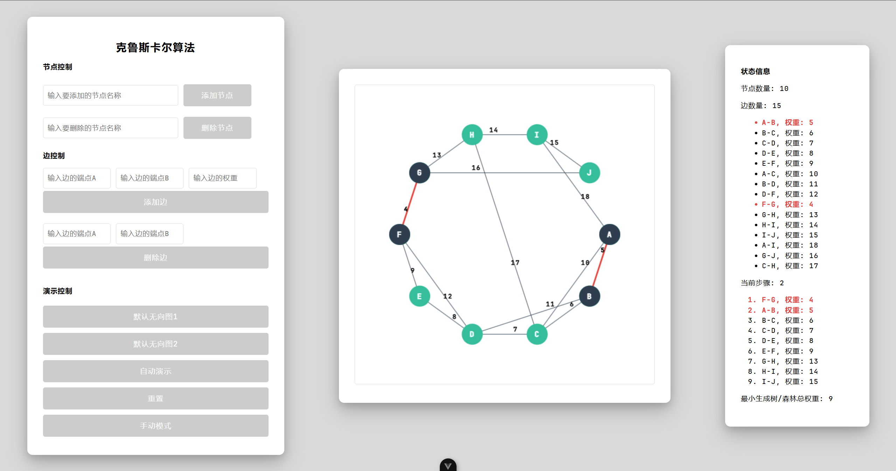
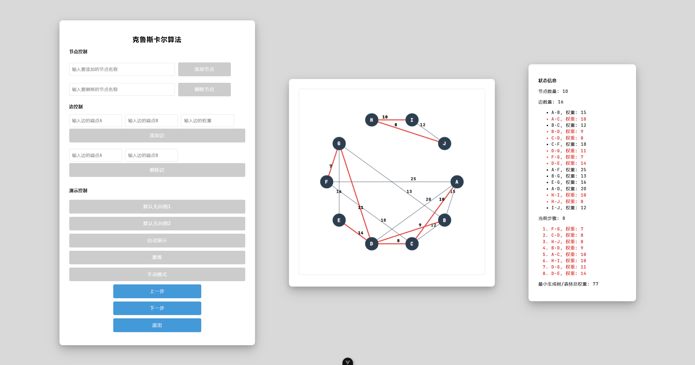
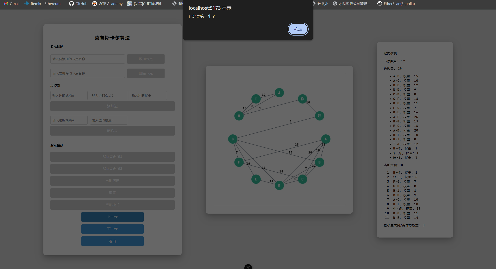

# KruskalViz

🌐 [简体中文](README.md) / [繁體中文](README_hant.md) / [English](README_en.md) / [日本語](README_jp.md) / [한국어](README_ko.md)🌐

克鲁斯卡尔算法（最小生成树）可视化演示工具，使用 Vue3 构建，支持动态添加节点、编辑边权值、演示最小生成树生成过程。适合算法教学、学习与研究参考。

## 项目简介

在学习图算法、尤其是最小生成树算法时，通常缺乏直观、可交互的演示工具。KruskalViz 致力于填补这一空白：

- 用户可以通过可视化界面 **动态添加/删除节点**、**新增/编辑边与其权值**。
- 支持手动操作与自动演示两种模式：展示 Kruskal 如何一步步选边、合并连通分量、直到生成最小生成树。
- 界面友好、代码清晰、适于教学、课堂演示、学生自主练习或研究演示使用。


## 核心特性

- **节点动态操作**：点击画布即可创建节点，拖拽可移动节点位置。
- **边与权值编辑**：可在节点之间绘制边，双击或输入框修改权值。
- **算法动画演示**：点击「开始演示」即可观看 Kruskal 算法全过程，包含边排序、选择、跳过、并查集合并等过程。
- **手动/自动切换**：演示可暂停、单步执行，也可设置自动播放速度。
- **状态提示**：当前正在处理的边、已选边、已跳过边、合并操作等均有视觉提示。
- **重置/重新编辑**：可随时清空画布或回退操作，重新编辑图输入。


## 预览效果








## 快速开始

### 在此之前

- 安装 Node.js（建议 v16 或以上）
- 安装包管理工具，如 npm 或 pnpm
- 基础了解 Vue 3 项目结构

### 安装与运行

1. 克隆仓库

   ```bash
   git clone git@github.com:victifa/KruskalViz_22.git
   cd KruskalViz_22
   ```

2. 安装依赖（以 `pnpm` 为例）

   ```bash
   pnpm install
   ```

3. 使用开发模式运行

   ```bash
   pnpm run dev
   ```

4. 网页访问

   打开浏览器访问 `http://localhost:3000`（或终端提示的地址）即可看到界面。

### 构建发布

```bash
pnpm build
# 构建结果通常在 dist/ 目录，可将其部署至任意静态服务器或 GitHub Pages
```


## 使用指南

### 界面说明

- 左侧/顶部工具栏：包含「新增节点」「新增边」「删除」「重置」「开始演示」等按钮。
- 主画布区域：用于展示节点（圆点）与边（线段 + 权值）。
- 右侧/底部状态栏：显示算法当前步骤、选边列表、已生成树的边、跳过的边等。

### 操作流程

1. 点击“新增节点”按钮，在画布任意位置点击创建节点。
2. 切换至“新增边”模式，点击两个节点间建立一条边。
3. 双击边权值文本或在属性面板输入框修改权值。
4. 完成图构建后，点击“开始演示”按钮。
5. 在演示过程中，可通过“暂停／继续”按钮或“单步执行”模式控制流程。
6. 演示结束后，查看生成的最小生成树，或点击“重置”重新编辑输入。

### 算法演示流程

- 系统首先读取所有边并按权值从小到大排序。
- 使用并查集（或等效结构）判断每条边是否连接两个不同集合。
- 如果连接，则选入生成树并合并集合；否则跳过。
- 重复直到节点全部连通或无更多可选边。
- 在画面中，将 “当前处理的边” 高亮、“已选边” 显示为绿色、“跳过边” 显示为灰色。
- 最终生成树用粗线或其他颜色突出显示。


## 未来计划

以下是一些可能的未来扩展方向：

- 支持 **Prim 算法** 的可视化 (和 Kruskal 作对比)
- 支持 **随机图生成** (自动生成一些随机节点与边)
- 支持 **图导入 / 导出** (例如 JSON / GraphML 格式)
- 美化动画 (如平滑边的高亮、颜色渐变)
- 支持 **教学模式**：展示伪代码 + 注释 + 步骤说明
- 支持 **并查集结构可视化增强**：显示父指针、秩 (rank)、路径压缩过程
- 响应式支持 (移动端 / 平板)


## 贡献指南

欢迎贡献！如果你想参与开发：

1. Fork 本仓库
2. 创建你的 feature 分支 (`git checkout -b feature/你的功能`)
3. 提交你的改动 (`git commit -m "feat: 描述你的改动"`)
4. 推送到你的仓库 (`git push origin feature/你的功能`)
5. 提交 Pull Request (PR)，并描述你的改动内容与目的

请确保代码风格一致、添加必要注释，并在 PR 中附带截图 / 演示 (如果是可视化修改)。


## 许可证

本项目使用 **MIT 许可证**。详见 [LICENSE](LICENSE) 文件。